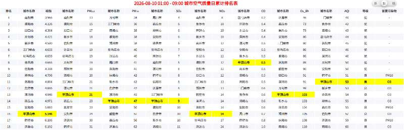
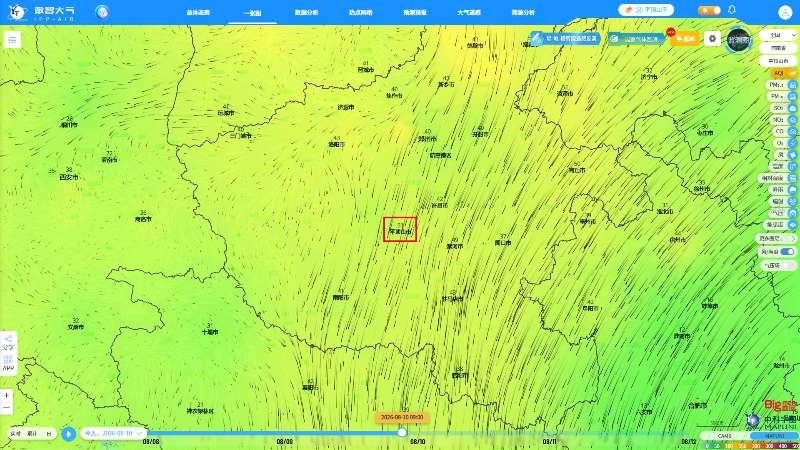
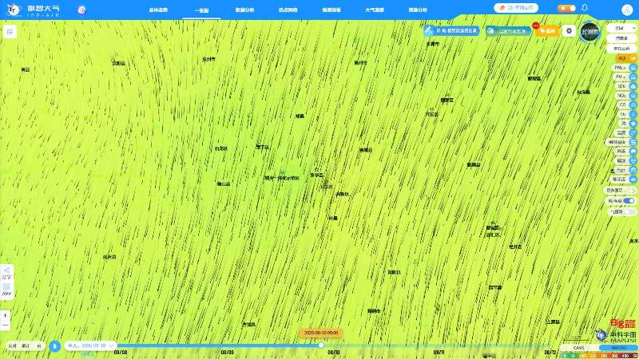
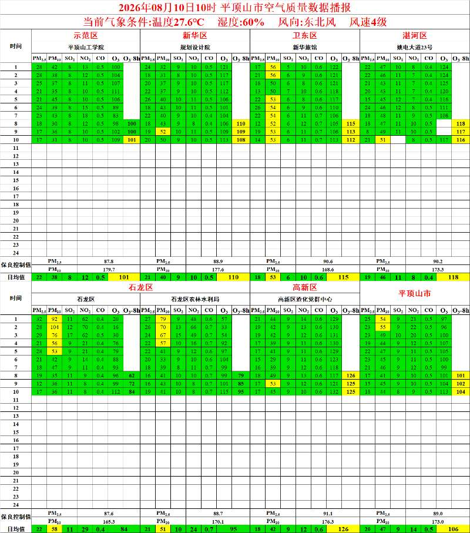
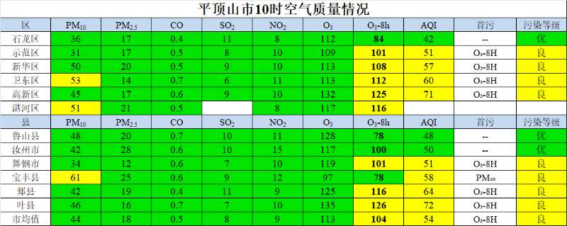

# 项目交接文档

## 一、项目概述

### 1.1 项目定位

Envclaw 是基于 Hermes Agent 深度改造的 AI 智能体桌面客户端应用，核心定位是面向终端用户（非开发者）的图形化 AI 工作平台。用户通过图形界面即可完成全部操作，无需接触命令行或配置文件。产品围绕五大方向构建：

1. **智能问数**：自然语言查询空气质量数据（浓度排名、站点数据、一张图、数据分析报告），目标是集成数智大气的智能问数智能体
2. **无人值守**：7×24 定时任务自动化，预置基于数智大气平台的各类值守功能，成果自动推送至微信/飞书/企业微信等渠道
3. **任务模板库**：支持添加任务模板，便于快速复刻能力，实现跨环境复用与分享
4. **平台管理**：支持接入自定义第三方平台，可保存凭证、添加自定义技能与 MCP 连接器，构建可扩展的能力生态
5. **Web 支持**：支持服务端部署，用户可通过 Web 页面访问（多用户 Web 版规划中）

### 1.2 技术架构

| 层 | 技术选型 | 说明 |
|---|---|---|
| 桌面容器 | Electron | 跨平台桌面应用，内置 Python + Hermes Agent 运行时，开箱即用 |
| 前端 | Vue 3 + TypeScript + Vite + Naive UI + Pinia | Composition API，多语言（vue-i18n），多主题 |
| BFF 网关 | Koa 2 + Socket.IO + SQLite | 统一 API 网关、实时通信（`/chat-run`）、会话与业务数据持久化 |
| Agent 层 | Hermes Agent (Python) | Agent Bridge 桥接、Skill 技能执行、任务调度 |
| 浏览器自动化 | agent-browser / Playwright | 数智大气平台登录与页面截图采集 |

### 1.3 核心概念

| 概念 | 定义 |
|---|---|
| 平台 | 数据源系统（数智大气为内置底座），每个平台提供若干「能力」 |
| 能力 | 平台提供的可执行操作（一张图 / 浓度排名 / 小时播报 / 监测数据），是任务的最小组成单元 |
| 技能 Skill | 基于 prompt 模板 + 上下文注入的可复用脚本，封装能力的执行逻辑 |
| 连接器 MCP | Model Context Protocol 标准服务，支持 stdio（本地）与 HTTP（远程）两种传输方式 |
| 任务 | 由能力组合 + 调度规则 + 推送渠道构成的定时值守单元 |
| 模板 | 任务的「配方」，封装能力组合与配置，支持克隆、分享、导入 |

## 二、仓库说明

### 2.1 仓库地址

| 远端 | 地址 | 说明 |
|---|---|---|
| origin | `https://github.com/Acerola-1/envclaw.git` | 当前私有协作仓库（个人 + 李莎协作开发） |

### 2.2 目录结构

| 目录 | 说明 |
|---|---|
| `packages/client` | Vue 3 前端（视图、组件、Store、API、i18n） |
| `packages/server` | Koa BFF 网关（路由、控制器、服务、SQLite、Agent Bridge） |
| `packages/desktop` | Electron 桌面端（主进程、运行时打包、自动更新） |
| `packages/skills` | Skill 技能源码（mapairs 数智大气截图技能等） |
| `packages/esp32-c3` | ESP32-C3 固件（MCU 语音中继） |
| `docs` | 项目文档（设计文档、链路变更、部署与发版说明） |
| `openspec` | OpenSpec 变更提案（proposal / design / tasks） |
| `tests` | Vitest 单元测试与 Playwright E2E 测试 |
| `scripts` | 构建与检查脚本（setup、harness-check、openapi 生成等） |
| `bin` | CLI 入口（hermes-web-ui 等） |
| `.github/workflows` | CI/CD 工作流（构建、测试、Docker、桌面发布） |

### 2.3 软件依赖与更新包下载

软件的运行依赖（Python 运行时、Hermes Agent 等）和新版本安装包均**从公司服务器下载**，而不是从公网获取。

**下载地址（公司服务器）**

| 用途 | 地址 | 说明 |
|---|---|---|
| 客户端自动更新 | `https://www.mapairs.com/datacenter/claw/updates` | 按平台分目录：`mac/`（`latest-mac.yml` + `Claw-x.x.x-arm64.dmg`）、`win/`（`latest.yml` + `Claw-x.x.x-x64.exe`）、`linux/` |
| Hermes runtime 依赖包 | `https://www.mapairs.com/datacenter/claw` | 按版本隔离目录：`hermes-0.17.0-runtime/`、`hermes-0.18.0-runtime/` 等，内含各平台 `tar.gz` 及 `.sha256` 校验文件 |

**下载逻辑**

- 桌面端首次启动/切换版本时，按需从公司服务器下载**指定版本**的 runtime（内置 Python + Hermes Agent + Node），下载后校验 SHA256、解压并激活
- 客户端启动 30 秒后首次检查更新，之后每 4 小时检查一次；检测到新版本自动下载，下载完成后提示重启安装
- 相比公网直连，公司服务器下载速度更稳定，用户体验更好

**可配置覆盖**（环境变量）

| 环境变量 | 说明 |
|---|---|
| `HERMES_DESKTOP_UPDATE_URL` | 覆盖客户端自动更新地址 |
| `HERMES_DESKTOP_RUNTIME_BASE_URL` | 覆盖 runtime 依赖下载地址 |
| `HERMES_WEB_UI_DOWNLOAD_BASE_URL` | 覆盖 Web UI 版本下载地址 |

### 2.4 注意事项

- 当前处于项目初期，**未开设正式仓库**；目前在 GitHub 上开设了一个**私有仓库**（`Acerola-1/envclaw`）用于个人与李莎的协作开发
- 对接完毕后，可考虑将仓库**移交至公司代码仓库**；具体移交事宜需向**德奇总**确认

## 三、页面原型

### 3.1 原型入口

- **原型目录**：`/Users/acerola/Dev/Frontend/envclaw/docs/prototypes`
- 所有原型为静态 HTML + `duty-proto.css`（黑白水墨 Pure Ink 风格底座），双击 HTML 即可在浏览器中直接预览
- 这些原型是**产品设计阶段的交互原型**（数据为前端脚本模拟），用于确认产品形态；**当前真实功能已在 Vue 前端 + Koa 后端中落地**，原型仅作设计参考与验收对照

### 3.2 原型页面清单

| 页面 | 说明 |
|---|---|
| `login.html` | 登录页（数智大气平台账密登录） |
| `duty-chat.html` | 对话·新建任务入口：自然语言问数、能力 Chip 快捷填充、意图识别转值守草稿卡 |
| `chat-create-task.html` | 对话转值守任务闭环演示（草稿卡 → 创建为值守任务） |
| `duty-tasks.html` | 自动化任务列表：状态筛选、搜索、任务卡操作（编辑/立即运行/暂停/删除）、三层运行记录 |
| `duty-task-detail.html` | 任务详情：配置 / 运行日志 / 成果 3 Tab |
| `duty-picker.html` | 模板/能力/技能/连接器 4 Tab 选择器，勾选后跳创建页预填 |
| `duty-create.html` | 创建任务向导：融合式大提示词、能力组合、调度频率、推送渠道、保存为模板 |
| `templates-library.html` | 任务模板库：分组 Tab、方形卡片网格、克隆/分享/派生任务 |
| `template-editor.html` | 模板编辑器：基本信息、能力配置、调度推送、角色提示词 4 段 |
| `template-share.html` | 模板分享/导入：导出 tar.gz、导入冲突策略 |
| `duty-capabilities.html` | 能力底座：平台 / 能力 / 技能 / 连接器（MCP）4 Tab 统一管理 |
| `platform-onboarding.html` | 平台接入向导：平台信息 → 认证 → 能力映射 → 测试确认 |

### 3.3 设计文档

- **页面设计**：`/Users/acerola/Dev/Frontend/envclaw/docs/prototypes/UniEcoClaw产品页面说明.md`（v0.7，设计中）
- **功能设计**：`/Users/acerola/Dev/Frontend/envclaw/docs/prototypes/UniEcoClaw产品功能说明.md`（v2.0）
- 另有配套文档：`PAGE-DESIGN.md`、`PAGE-GUIDE.md`、`PRODUCT-FUNCTION-DESIGN.md`、`PRODUCT-ROADMAP.md`

**简要总结**：

- **定位**：面向环保业务的「自然语言问数 + 定时值守」双引擎平台（品牌名 UniEcoClaw），目标用户 80% 为非技术业务用户
- **改版目标**：解决三大短板——模板无法复刻、新平台无法零代码接入、Skill/MCP 藏在设置菜单不可发现；信息架构收敛为「新建任务 / 自动化 / 任务模板库 / 能力·技能·连接器」4 个顶级入口
- **六大模块**：对话问数、自动化调度（三层运行记录）、任务模板库、能力底座（12 项能力）、技能管理、MCP 连接器管理；横切认证、权限等级、审计日志
- **路线图与进度**：
  - **阶段 0 · 原型 Mock**：已完成。静态 HTML 原型用于产品设计验证，已基本完成
  - **阶段 1 · Web UI 服务端（大部分已落地）**：
    - 平台管理：`envclaw_platforms` / `envclaw_platform_functions` / `envclaw_platform_accounts` 三张真实 SQLite 表，平台/能力/账号 CRUD，凭证 **AES 加密存储**，Mapairs 凭证运行时文件供技能即时读取
    - 任务调度：对接 Hermes profile 的 `cron/jobs.json`，由 Hermes 调度执行；前端 JobsPage / JobDetailPage（运行记录）已实现
    - Skill 管理：导入（zip/文件夹）、启用/禁用/删除已实现
    - MCP 管理：`envclaw-api` / `envclaw-devices` / `envclaw-use` / `datacenter-statistics` / `ipp-air` 5 个内置 MCP 启动时自动注入
    - Envclaw 工作台前端：WorkstationHome / SmartQuery（智能问数）/ Jobs / Guard / Platforms / Skills / History 等页面已实现，对话支持「智能问数 / 自动化值守」双模式
    - mapairs 技能：`mapairs-common` 公共模块 + 小时播报 / 监测数据 / 浓度排名技能已开发，URL 直连截图改造进行中
  - **阶段 2 · Hermes Agent 完整接入（进行中）**：任务已由 Hermes skill 执行、凭证已运行时注入；模板后端表、推送渠道完善、技能沙箱等仍在推进
  - **阶段 3 · 多平台与Web 版本（远期）**

## 四、目标功能

### 4.1 智能问数

**当前实现（按源码）**：

- 基于 Hermes Agent 的基础对话能力（Socket.IO `/chat-run` 链路，走 Agent Bridge）
- 已接入平台 MCP 连接器（`envclaw-api` 等内置 MCP 提供任务/模板/平台查询等工具）
- 对话界面已支持「智能问数 / 自动化值守」双模式切换（`ChatPanel` 的 `appMode`）
- 前端入口：WorkstationHome / SmartQueryPage
- **尚未做过多产品设计**，当前即为基础对话 + 平台 MCP 能力

**目标功能（按设计文档/原型）**：

- 集成**数智大气平台智能问数智能体**：自然语言查询空气质量数据（浓度排名、站点数据、一张图、数据分析报告）
- 能力 Chip 快捷填充、Slash 指令、意图识别转值守任务草稿卡、模型选择等交互（对应 `duty-chat.html`）
- 该方向后续需重点规划与设计

### 4.2 无人值守

**当前实现**：

- 已实现**数智大气平台 4 个核心功能**（以 Skill 形式落地）：
  - 一张图（`mapairs-onemap-capture`）
  - 浓度排名（`mapairs-ranking-capture`）
  - 小时播报（`mapairs-hourly-brief`）
  - 监测数据（`mapairs-monitoring-data`）
- 任务创建向导（`CreateTask.vue`）：融合式大提示词 + 能力组合 + Cron 调度 + 推送目标
- 任务管理：CRUD、启停、立即执行、运行记录（JobsPage / JobDetailPage）
- 任务写入 Hermes profile 的 `cron/jobs.json`，由 **Hermes Gateway** 调度执行；创建任务时自动确保 Gateway 运行
- 推送目标（`deliver`）从后端接口拉取

**实现原理**：

**（1）截图类能力：带参 URL + Playwright 截图**

数智大气平台的「一张图」「浓度排名」「小时播报」等截图类能力，统一采用**带参 URL 直连 + Playwright 脚本截图**模式，不再逐级点击菜单（页面结构变化不易失效）：

- **URL 拼接**：每个技能附带独立 Playwright 脚本（`mapairs_onemap_capture.py` / `mapairs_ranking_capture.py` / `mapairs_hourly_brief.py`），执行时读取任务成果的 `config` JSON，用参数拼接页面完整 URL 后直接跳转截图：
  - **浓度排名**：`/dataStatistics/concentrationranking?theme=&zone=&province=&region=&sTime=&eTime=&type=&index=`；`type` 支持 `hourly`（实时）/ `daily_count`（日累计）/ `daily` / `month` / `year`；因子支持 PM2.5、PM10、SO2、NO2、CO、O3、AQI（URL 用半角，脚本内需转 Unicode 下标）
  - **一张图**：`/oneMap?theme=&factor=&leftPanel=&region=&windWaves=&mode=`；Mapbox 地图页面需走 **CDP 协议截图**，普通截图无法捕获
  - **小时播报**：`/hourlyBrief` 定位后按行政区、污染因子截取页面
- **公共模块 `mapairs-common`**：抽取登录、预检、截图、凭证读取、会话管理、渲染等待等公共逻辑，供各技能复用
- **强制预检（preflight）**：脚本执行前检查 Python 版本、Python Playwright、Chromium 能否无头启动、数智大气主机是否可解析、凭证是否已注入；任一项不满足即停止并报告明确错误
- **凭证注入**：用户在 Envclaw 登录数智大气平台后，凭证 AES 加密存入 `envclaw_platform_accounts` 表，并同步写入运行时凭证文件（`.mapairs-credentials.json`，权限 0600）；技能执行时自动读取，无需重启 Gateway；基础地址可用 `MAPAIRS_BASE_URL` 覆盖
- **成果投递**：脚本输出 `ARTIFACT:<绝对路径>` 与 `MEDIA:<绝对路径>`，Hermes 据此将截图作为**原生媒体**自动投递到任务配置的推送目标（`deliver`）

**（2）数据获取类能力：MCP**

监测数据、小时播报数据等**数据获取类能力通过 MCP 服务实现**，而非浏览器操作：

- Envclaw 启动时自动注入 3 个 stdio MCP（`envclaw-api` 任务/模板/平台查询、`envclaw-devices` 设备管理、`envclaw-use` 网页搜索/URL 抓取/文件读写）+ 1 个 HTTP MCP（`ipp-air-mcp-server` → `https://www.mapairs.com/product/datacenter/api2/mcp`）
- 另可接入数智大气数据中心统计服务等 HTTP MCP（Spring AI MCP，提供统计查询工具）
- Agent 在任务执行时通过 MCP 工具**直接调用平台数据接口**获取结构化数据，再交给分析/播报流程处理

**（3）任务调度链路**：

```
任务创建(CreateTask.vue) → 写入 Hermes profile cron/jobs.json
  → Hermes Gateway 定时触发 → 调用对应 Skill
  → Playwright 脚本截图(带参 URL) 或 MCP 工具取数
  → 产物按 deliver 推送(截图作为原生媒体)
```

**目标功能（按设计文档/原型）**：

- 覆盖**数智大气平台的所有数据分析功能**，扩展值守场景
- 预置 6 大专家值守方案：城市排名分析、数字播报、截图采集、高值提醒、达标测算、日报通报
- 三层运行记录（任务 → 时间点 → 执行详情）、成果下载、基于运行结果开启专项对话
- 成果推送渠道完善（微信/飞书/企业微信等）

### 4.3 平台接入

**现状**：

- 目前**内置数智大气平台**（`szdq`），以 Skill 形式提供 4 项核心能力（一张图/浓度排名/小时播报/监测数据）
- 平台/能力/账号管理的底层已实现：`envclaw_platforms` / `envclaw_platform_functions` / `envclaw_platform_accounts` 三表 CRUD、凭证 AES 加密存储、Mapairs 凭证运行时注入

**目标功能（待实现，按设计文档/原型）**：

- **支持接入任意第三方平台**，扩展平台生态
- 支持**凭证登录**（OAuth2 / API Key / 账号密码）
- 每个平台可**绑定各自的技能（Skill）、连接器（MCP）、功能（能力）**
- 平台接入向导（4 步）：平台信息 → 认证 → 能力映射 → 测试确认（对应 `platform-onboarding.html`）
- 长期目标：零代码接入——前端能力列表改为从后端 API 动态拉取，新增平台自动出现，无需改源码重新发版

### 4.4 规划中的功能

- **任务模板库**：后端模板表 + 克隆/分享/导入（当前为前端硬编码场景模板，仅「数据播报」可用）
- **多用户 Web 版**：服务端部署、用户隔离、团队协作
- **多工作空间与精细权限**：功能可见性、使用次数、资源配额、操作权限（远期）
- **技能生态**：技能沙箱、技能市场、第三方 Skill 绑定
- **连接器统一管理界面**：stdio/HTTP 连接器的统一管理、工具清单、免确认授权

### 4.5 平顶山团队真实需求

分三块：

**第一块：数智大气平台截图推送**

- 功能：数智大气平台的「一张图」和「浓度排名」功能

- 频率：每小时 40 分左右推送

- 要求生成三张图：
  1. **第一张**：数智大气平台浅色模式下的**日累计最新浓度排名**页面截图
  
     
  
  2. **第二张**：一张图页面浅色、**插值图**、**关闭左侧面板**，并**标记平顶山市边界**
  
     
  
  3. **第三张**：**缩放至平顶山区县级别**，再截图
  
     

**第二块：河南省大数据平台小时播报数据计算**

- 河南省大数据平台的小时播报数据计算流程

- 该流程较为复杂，涉及**内网平台登录**、**Excel 数据处理**

- 详细需求需咨询**杨山波**

  

  

**第三块：小时浓度数据总结性文字定时推送**

- 实现小时浓度数据的**总结性文字**，定时推送

- 详细需求需咨询**杨山波**

  【新华区、卫东区、高新区、宝丰县PM10高值提醒】
        9时数据显示，新华区、卫东区、高新区、宝丰县PM10浓度均为良，高于市均值及周边区域，外界北风，建议：【新华区、卫东区、高新区、宝丰县】强化重点区域道路洒水、雾炮作业频次，全面排查辖区工地内部道路、裸土苫盖等抑尘工作落实情况，同步做好涉尘企业扬尘管控，企业应保持厂区清洁，堆场料场密闭覆盖到位。
